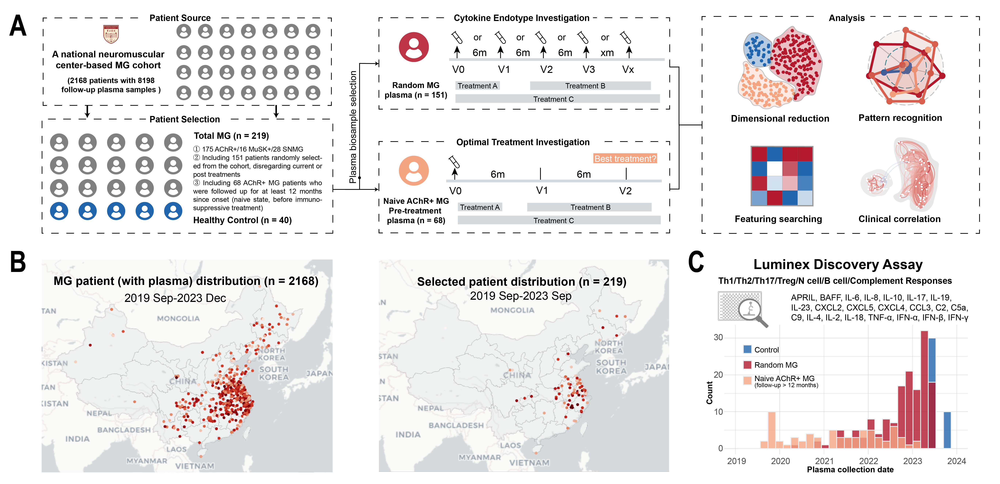

# MG Cytokine Endotype
> A plasma cytokine/complement/chemokine endotype investigation on myasthenia gravis 

## Data source

- **MG patients** (AChR+, n = 175/ MuSK+, n = 16 / SNMG,  n = 28).
- **Healthy controls** (n = 40).

- **Plasma biomarkers**:  a) Th1 response (TNF-α, IFN-α, IFN-β, IFN-γ), b) Th2 response (IL-4, IL-6, IL-18), c) Th17 response (IL-17 and IL-23), d) Treg response (IL-2, IL-10, IL-19), e) Neutrophil (N)-cell response (IL-8, CCL3, CXCL2, CXCL4, CXCL5), f) B-cell response (BAFF and APRIL), and g) complement response (C2, C5a, C9).
- **Instrument**: Human Luminex Discovery Assay panels (R&D Systems).

## Dataset description 

Original dataset can be downloaded from the release section on the right panel.

- **Endotype_scanpy.xlsx** (raw data)
  - **Integration.endotype**:  biomarker concentrations for each Bio-sample ID (Bio_ID)
  - **Integration.meta**: meta data (Bio_ID, Visiting_date, Category_1, Category_2, Status, J_type, Antibody, ClinicalType, 	ClinicalType_2, Immunosuppression_before, Thymoma, Thymectomy, Gender, Visiting_age, Onset_age, Duration, ADL_all, QOL_all, MGC_all, QMG_all, Prognosis_6m, Prognosis_12m, Steroid_response, leiden, Age_range.
- **adata_endotype.h5ad** (Scanpy processed data)

## Citation

