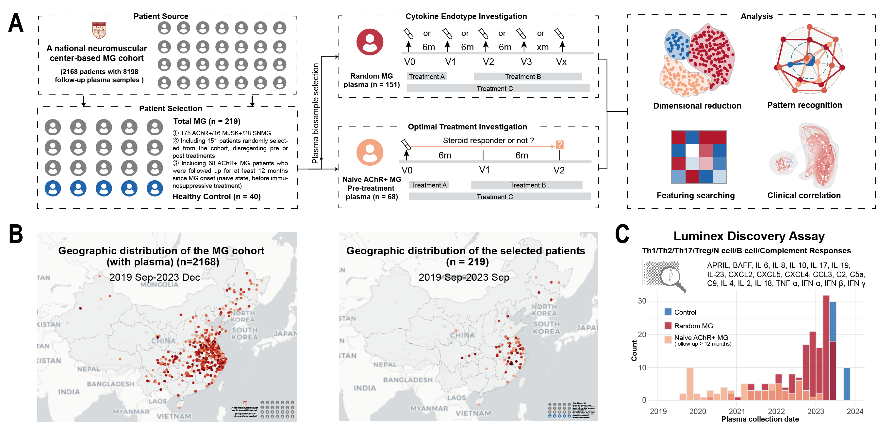

# MG Cytokine Endotype
> A plasma cytokine/complement/chemokine endotype investigation on myasthenia gravis 

## Data source

- **MG patients**: (AChR+, n = 175/MuSK+, n = 16/SNMG,  n = 28).
- **Healthy controls**: (n = 40).

- **Plasma biomarkers**:  
  - a) Th1 response (TNF-α, IFN-α, IFN-β, IFN-γ)
  - b) Th2 response (IL-4, IL-6, IL-18), 
  - c) Th17 response (IL-17 and IL-23), 
  - d) Treg response (IL-2, IL-10, IL-19), 
  - e) Neutrophil (N)-cell response (IL-8, CCL3, CXCL2, CXCL4, CXCL5), 
  - f) B-cell response (BAFF and APRIL), 
  - g) complement response (C2, C5a, C9).

- **Instrument**: Human Luminex Discovery Assay panels (R&D Systems).

## Dataset description 

The original dataset is in the Data folder.

- **Endotype_scanpy.xlsx** (raw data)
  - **Integration.endotype** (plasma biomarker data, pg/ml)
  - **Integration.meta** (meta data)
- **adata_endotype.h5ad** (Scanpy processed data)

## Citation

